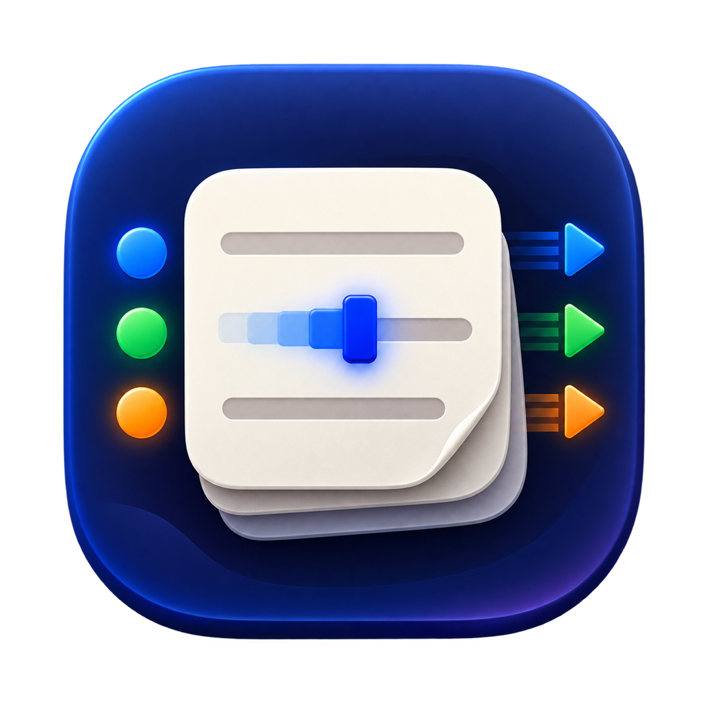

# ViMotes

<p align="center">
  
</p>

**Vim motions and modes for Apple Notes.**


ViMotes is a lightweight macOS menu bar app that brings a focused Vim-like editing experience to Apple Notes. It translates Vim commands into native keyboard events, preserving rich text, lists, checklists, links, and attachments.

ViMotes only activates while an editable area in Apple Notes is focused. Everywhere else, it stays out of the way.

> [!NOTE]
> ViMotes is currently an early-stage project. The core editing workflow is usable, but exact behavior can still vary inside Apple Notes rich-text structures.

## Features

- Normal, Insert, and Visual modes
- Familiar motions such as `h`, `j`, `k`, `l`, `w`, `b`, `e`, `0`, `_`, `$`, `gg`, and `G`
- Composable `d`, `c`, and `y` operators, line commands, numeric counts, and dot repeat
- Common editing commands including `x`, `X`, `r`, `J`, `u`, `Ctrl-r`, `p`, and `P`
- Paragraph navigation, half-page scrolling, and native Apple Notes search
- Native macOS keyboard events instead of direct note content manipulation
- Automatic activation only inside the Apple Notes editor
- Pass-through behavior for every key or shortcut ViMotes does not handle
- Optional mode indicators in the menu bar and inside the active Apple Notes window
- Optional automatic launch when signing in to macOS
- Brief visual confirmation in the Notes window after yanking a selection
- A menu bar control to enable or disable ViMotes
- No analytics, telemetry, or note-content transmission
- Automatic updates for signed release builds
- Free and open source under the MIT License

## Requirements

- macOS 13 or later
- Swift 6.2 toolchain, available with Xcode 26 or later
- Accessibility permission for the built application

## Download

Signed and notarized builds will be available from
[GitHub Releases](https://github.com/YassineBenh/vimotes/releases). Download the latest
DMG, move ViMotes to Applications, and launch it from there.

## Build from Source

```sh
git clone https://github.com/YassineBenh/vimotes.git
cd vimotes
swift test
./scripts/build-app.sh
open dist/ViMotes.app
```

The build script creates `dist/ViMotes.app`. It automatically uses the first available Apple Development signing identity so macOS can preserve the app's Accessibility permission between builds. If no development certificate is available, it falls back to an ad hoc signature.

To select a specific identity, set `VIMOTES_CODESIGN_IDENTITY` before building:

```sh
VIMOTES_CODESIGN_IDENTITY="Apple Development: Your Name" ./scripts/build-app.sh
```

If no development certificate is available, the script uses an ad hoc signature. macOS may then require Accessibility permission again after rebuilding.

## Getting Started

1. Launch `ViMotes.app`.
2. Grant ViMotes access in **System Settings → Privacy & Security → Accessibility**.
3. Open Apple Notes and place the cursor in an editable note.
4. Start navigating in Normal mode, or press `i` to enter Insert mode.

By default, the current mode appears both in the menu bar and in the lower-right corner of the active Apple Notes window. The window indicator follows Notes as it moves or resizes, then disappears when the editor is no longer active. The menu bar item remains available and switches to a neutral status icon. Standard `⌘` shortcuts continue to work in every mode.

## Settings

Open the ViMotes menu bar item and choose **Settings…** to access one unified interface:

- **General** controls the mode indicators, launch at login, and automatic updates. It also provides direct links to the source code and GitHub Issues.
- **Commands** lists every Vim command currently supported by ViMotes.
- **Accessibility** shows the live permission status, explains why access is needed, and opens the relevant System Settings page.

Preference changes apply immediately and persist between launches.

## Supported Commands

| Mode | Commands | Description |
| --- | --- | --- |
| Normal | `h` `j` `k` `l` | Move left, down, up, and right |
| Normal | `w` `b` `e` | Move forward, backward, or to the end of a word |
| Normal | `0` `_` `$` | Move to the start or end of the line |
| Normal | `gg` `G` | Move to the start or end of the document |
| Normal | `{` `}` | Move to the previous or next paragraph |
| Normal | `Ctrl-u` `Ctrl-d` | Scroll up or down by half a window |
| Insert | `i` `a` `I` `A` | Enter Insert mode at different cursor positions |
| Insert | `o` `O` | Open a new line below or above |
| Editing | `x` `X` | Delete the character after or before the cursor |
| Editing | `D` `Y` `C` `S` | Delete, yank, or change complete lines and ranges |
| Editing | `J` `r{character}` | Join lines or replace characters |
| Operators | `dd` `yy` `cc` | Delete, yank, or change one or more complete lines |
| Operators | `d` `c` `y` + motion | Apply an operation to a Vim motion, such as `dw`, `c$`, or `ygg` |
| Editing | `u` `Ctrl-r` | Undo or redo |
| Editing | `p` `P` | Paste after or before the cursor |
| Editing | `.` | Repeat the last edit, including directly typed Insert text |
| Search | `/` `n` `N` | Open Notes search and move to the next or previous result |
| Normal and Visual | `[count]` + command | Repeat a motion or command, such as `3w`, `2x`, or `5dd` |
| Normal | `v` or `V` | Enter Visual mode by selecting a character or the current line |
| Visual | A motion | Extend the current selection using Vim motions |
| Visual | `d` `x` `c` `y` | Delete, change, or copy the selection |
| Any active mode | `Esc` | Return to Normal mode or cancel the selection |

Keys and shortcuts that do not match a supported ViMotes command pass through unchanged, allowing native Apple Notes behavior and global shortcuts to keep working.

## How It Works

The `ViMotesCore` module contains a platform-independent state machine that translates keyboard input into Vim actions. The macOS application listens for keyboard events, confirms that an Apple Notes editor is focused, and executes those actions using native movements and shortcuts.

ViMotes does not request existing note text through Accessibility or transmit note contents. To support dot repeat, it temporarily retains directly typed Insert text in process memory. Yank and paste use the standard macOS clipboard through native keyboard shortcuts. See [Privacy](PRIVACY.md) for details.

ViMotes makes no analytics or license requests. Signed release builds contact the Sparkle appcast only when checking for updates. See [Privacy](PRIVACY.md) for the exact data exchanged.

## Current Limitations

- Word, line, and document motions follow native macOS behavior and may differ slightly from Vim.
- Behavior inside tables, checklists, and attachments depends on Apple Notes' private rich-text editor.
- Text-object commands such as `ciw`, registers, macros, and character-find motions are not available yet.
- Dot repeat records directly typed Insert text; cursor moves and macOS shortcuts used during that Insert session are not replayed.
- `J` inserts a separating space but does not perform Vim's full whitespace normalization.
- Search uses Apple Notes' native Find interface rather than a Vim command line.
- Builds compiled from source do not check for automatic updates unless a Sparkle public key is configured in the application bundle.

## Development

```sh
swift build
swift test
```

Application code lives in `Sources/ViMotes/`. The testable Vim engine lives in `Sources/ViMotesCore/`, with its tests in `Tests/ViMotesCoreTests/`.

Release maintainers should follow [the distribution guide](docs/distribution.md). Signed releases are prepared locally with `scripts/release.sh` and published to GitHub with `scripts/publish-release.sh`.

## Contributing

Issues and pull requests are welcome. Before contributing, read the [repository guidelines](AGENTS.md), add tests for behavioral changes, and verify input handling manually in Apple Notes.

When reporting a bug, include your macOS version, the command sequence, the current mode, and the Apple Notes context where the issue occurred.

## License

ViMotes is available under the [MIT License](LICENSE).
